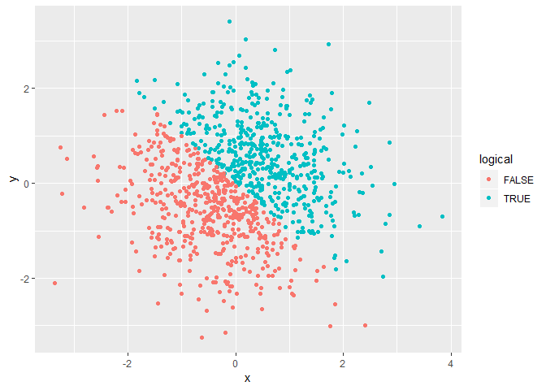
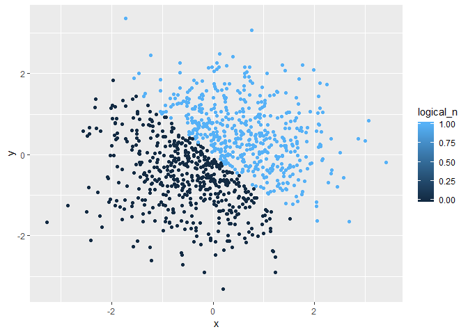
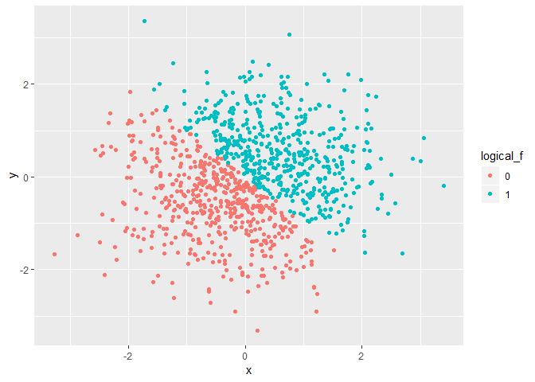

p8105\_hw1\_js5431
================
J Shearston
September 13, 2018

-   [Problem 1](#problem-1)
    -   [Creating variables](#creating-variables)
    -   [Creating a data frame comprised of the above four vectors](#creating-a-data-frame-comprised-of-the-above-four-vectors)
    -   [Taking the mean of each variable in the data frame](#taking-the-mean-of-each-variable-in-the-data-frame)
    -   [Applying the `as.numeric` function](#applying-the-as.numeric-function)
    -   [Converting variable types](#converting-variable-types)
-   [Problem 2](#problem-2)
    -   [Creating the described dataframe](#creating-the-described-dataframe)
    -   [Describing the dataset](#describing-the-dataset)
    -   [Scatterplot 1](#scatterplot-1)
    -   [Scatterplot 2](#scatterplot-2)
    -   [Scatterplot 3](#scatterplot-3)
    -   [Commenting on plot colors](#commenting-on-plot-colors)
    -   [Exporting Scatterplot 1](#exporting-scatterplot-1)
-   [Problem 3](#problem-3)

Problem 1
---------

#### Creating variables

Creating a random sample variable

``` r
ran_sam = rnorm(10, 0, 5)
```

Creating a logical vector

``` r
bigger2 = ran_sam > 2
```

Creating a character vector

``` r
animal = c("fish", "dog", "cat", "dolphin", "elephant", "dog", "cow", "fish", "fish", "dolphin")
```

Creating a factor vector

``` r
animal_f = factor(animal)
```

#### Creating a data frame comprised of the above four vectors

``` r
p1_df = tibble(
  ran_sam,
  bigger2,
  animal,
  animal_f
  )
```

#### Taking the mean of each variable in the data frame

``` r
mean(p1_df$ran_sam)
```

    ## [1] 0.8037066

``` r
mean(p1_df$bigger2)
```

    ## [1] 0.2

Notes: I am able to take the mean of the ran\_sam (random sample variable) and bigger2 (logical vector) variables becuase they are both numeric, but not the animal or animal\_f variables becuase they are character vectors.

#### Applying the `as.numeric` function

``` r
as.numeric(p1_df$bigger2)
as.numeric(p1_df$animal)
as.numeric(p1_df$animal_f)
```

Notes: The logical and factor variables can be coerced, while using the `as.numeric` function on the character variable results in NA for each observation. This occurs because the logical and factor variable both already have a numeric component of some type, while the character variable does not.

#### Converting variable types

``` r
factor(p1_df$animal)
```

    ##  [1] fish     dog      cat      dolphin  elephant dog      cow     
    ##  [8] fish     fish     dolphin 
    ## Levels: cat cow dog dolphin elephant fish

``` r
as.numeric(p1_df$animal)
```

    ## Warning: NAs introduced by coercion

    ##  [1] NA NA NA NA NA NA NA NA NA NA

``` r
as.character(p1_df$animal_f)
```

    ##  [1] "fish"     "dog"      "cat"      "dolphin"  "elephant" "dog"     
    ##  [7] "cow"      "fish"     "fish"     "dolphin"

``` r
as.numeric(p1_df$animal_f)
```

    ##  [1] 6 3 1 4 5 3 2 6 6 4

Notes: When the character variable is converted to a factor variable it is given levls, but when it is then converted to a numeric variable NA results. When the factor variable is converted to a character variable this seems to go smoothly, and can then also be transferred into a numeric variable such that each unique category in the variable is assigned a number

Problem 2
---------

#### Creating the described dataframe

``` r
x = rnorm(1000)
y = rnorm(1000)
logical = (x+y) > 0
logical_n = as.numeric(logical)
logical_f = factor(logical_n)

graphing_df = tibble(
  x,
  y,
  logical,
  logical_n,
  logical_f
  )
```

#### Describing the dataset

The dataframe called "graphing\_df" has a size of n=1000. The mean of x is 0.0392428, while the median is 0.030393. The proportion of cases for which the logical vector "logical" is TRUE is 499 / 1000.

#### Scatterplot 1

``` r
ggplot(graphing_df, aes(x = x, y = y, color = logical)) + geom_point()
```



#### Scatterplot 2

``` r
ggplot(graphing_df, aes(x = x, y = y, color = logical_n)) + geom_point()
```



#### Scatterplot 3

``` r
ggplot(graphing_df, aes(x = x, y = y, color = logical_f)) + geom_point()
```



#### Commenting on plot colors

In Scatterplot 1, the color scale is dichotomous (true/false) because the logical variable only has two categories. However, for Scatterplot 2, the color scale is a gradient because the variable type is numeric, so instead the colors are assigned based on quartiles. Scatterplot 3 uses a binary color scale similar to Scatterplot 1, because the variable used is a factor variable and also has only two categories (this time 0/1).

#### Exporting Scatterplot 1

``` r
ggsave("scatter_plot.pdf", height = 4, width = 6)
```

Problem 3
---------

Done! js5431 on 9/18/2018 :)
